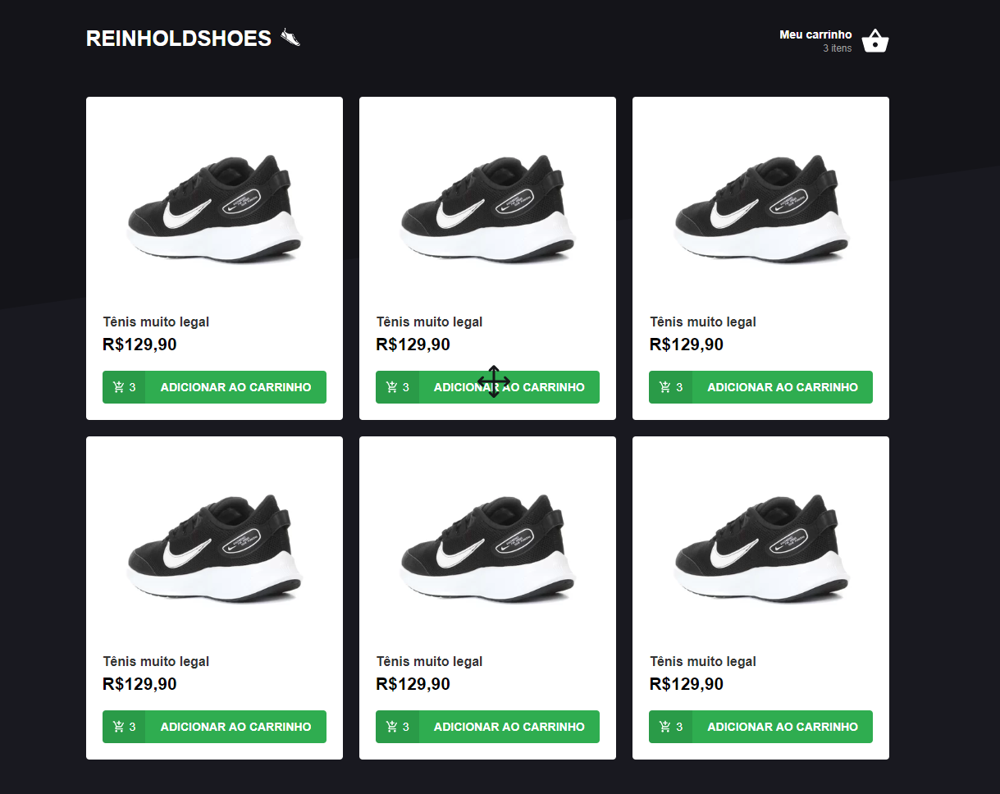

<h3 align="center">
  REINHOLDSHOES - A shoes store in React
</h3>

    

  <a href="#star-about-the-app">About the app</a>&nbsp;&nbsp;&nbsp;|&nbsp;&nbsp;&nbsp;
  <a href="#star-functionalities">Functionalities</a>&nbsp;&nbsp;&nbsp;|&nbsp;&nbsp;&nbsp;
  <a href="#star-printscren">PrintScren</a>

## :star: About the App

A shoes store using React.

## :star: Functionalities

#### 1. Add item to cart

You can add itens to cart.

## :star: PrintScren

  

